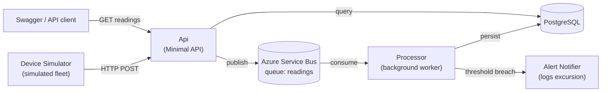

# ColdChainMonitor

A cold storage telemetry ingestion and alerting backend, built to demonstrate distributed,
async backend engineering patterns — message queues, background workers, and
event-driven alerting.

## What it does

Simulated cold storage devices (freezers, cold rooms) report temperature readings.
Readings are ingested, queued, processed asynchronously, and checked against
configurable alert thresholds — a breach (e.g. a freezer running warm) raises an
excursion and triggers an alert. It's the kind of pipeline that sits behind any real
IoT product, minus the hardware.

## Architecture



**Why this shape:** ingestion is deliberately decoupled from processing. `POST
/api/readings` validates the device exists, hands the reading to Service Bus, and
returns immediately — it never touches the database. All the actual work (persistence,
threshold evaluation, alerting) happens later, off the queue, in the Processor. This is
the core thing this project is trying to demonstrate that a synchronous CRUD API
doesn't: decoupled, asynchronous, queue-based processing.

## Projects

| Project | Purpose |
|---|---|
| `ColdChainMonitor.Domain` | Entities: `Device`, `Reading`, `AlertRule`, `Excursion`. Encapsulated (private setters, invariants enforced in constructors) rather than anemic. |
| `ColdChainMonitor.Application` | Interfaces, DTOs, and `ThresholdEvaluator` — the one piece of real business logic, deliberately written as a pure static function with no I/O, for easy unit testing. |
| `ColdChainMonitor.Infrastructure` | EF Core + Npgsql persistence, Azure Service Bus publisher/consumer, DI composition root. |
| `ColdChainMonitor.Api` | Minimal API. Device management, reading ingestion (publishes to queue), and read queries (reads straight from Postgres). |
| `ColdChainMonitor.Processor` | Background worker (`BackgroundService`). Consumes the queue, persists readings, evaluates alert rules, raises excursions. |
| `ColdChainMonitor.DeviceSimulator` | Standalone console/worker app. Registers simulated devices via the Api's own HTTP endpoints and streams readings, occasionally firing a deliberate out-of-range excursion. Not deployed — a local demo/testing tool only. |
| `ColdChainMonitor.Application.Tests` | Unit test project (xUnit). `ThresholdEvaluator` is structured specifically to be trivially testable in isolation. |

## Running locally

**Prerequisites:** .NET 10 SDK, Docker.

```bash
# 1. Start local Postgres
docker compose up -d

# 2. Apply EF Core migrations
dotnet ef database update --project src/ColdChainMonitor.Infrastructure --startup-project src/ColdChainMonitor.Api

# 3. Configure secrets (per project — these are NOT shared)
cd src/ColdChainMonitor.Api
dotnet user-secrets set "ServiceBus:ConnectionString" "<your Azure Service Bus connection string>"
cd ../ColdChainMonitor.Processor
dotnet user-secrets set "ServiceBus:ConnectionString" "<same connection string>"
cd ../..

# 4. Run each service in its own terminal
dotnet run --project src/ColdChainMonitor.Api          # Swagger at /swagger
dotnet run --project src/ColdChainMonitor.Processor
dotnet run --project src/ColdChainMonitor.DeviceSimulator
```

A local Azure Service Bus namespace is required even for local development — there's no
in-memory substitute here by design, since the point is to exercise the real managed
service.

**Try it end to end:**
1. `POST /api/devices` — register a device
2. `POST /api/alert-rules` — e.g. `{"deviceId": "<id>", "minTemperatureCelsius": -20, "maxTemperatureCelsius": -15}`
3. `POST /api/readings` — post a reading outside that range
4. Watch the Processor's console — an excursion warning should appear within moments
5. `GET /api/devices/{id}/readings` — confirm the reading was persisted regardless

## Deployment (Azure)

| Component | Azure service |
|---|---|
| Api | Azure Container Apps (external ingress, scales to zero when idle) |
| Processor | Azure Container Apps (internal, no ingress) |
| Container images | Azure Container Registry, pulled via managed identity — no registry credentials stored anywhere |
| Database | Azure Database for PostgreSQL Flexible Server (Burstable tier) |
| Message queue | Azure Service Bus (Basic tier) |

Both the Api and Processor are containerized (see each project's `Dockerfile`) and run
in the same Container Apps Environment — one HTTP-facing, one headless — which was a
deliberate choice to demonstrate orchestrating genuinely different service shapes on
one platform, rather than deploying everything as near-identical web apps.

### Cost and idle management

This is a portfolio project, not a production service, so it's provisioned to be cheap
and to be paused between working sessions:

- The Api scales to zero automatically; no cost while idle.
- The Processor currently runs as an always-on replica (`min-replicas: 1`) — this is a
  known simplification, not the end state. See [Next steps](#next-steps).
- Azure Database for PostgreSQL can be stopped (`az postgres flexible-server stop`) —
  **note:** Azure auto-restarts a stopped server after 7 days regardless, so this needs
  periodic manual re-stopping, not a one-time action.
- The Processor's Container Apps revision can be deactivated
  (`az containerapp revision deactivate`) to stop billing entirely — unlike Postgres,
  this stays off indefinitely with no auto-restart.
- Azure Container Registry (Basic tier) has a small flat monthly cost regardless of
  activity — the one piece of this stack that can't be pause d without deleting it
  outright.

## Known limitations / next steps

- **Processor scale-to-zero:** currently always-on in Azure for simplicity. The natural
  improvement is a KEDA scale rule against Service Bus queue depth, so it scales to
  zero when idle and wakes on message arrival, same as the Api already does.
- **DeviceSimulator device reuse:** registers a fresh batch of simulated devices on
  every run rather than reusing ones from a previous session — fine for a demo, not
  ideal for a long-running instance.
- **Test coverage:** `ThresholdEvaluator` was specifically designed for easy unit
  testing (pure function, no dependencies) but the test project is currently scaffolded
  without tests written yet.
- **Alert notification:** currently logs excursions only (`LoggingAlertNotifier`).
  Swapping in a real notification channel (webhook, email via SendGrid) is a same
  interface change (`IAlertNotifier`), not an architectural one.
